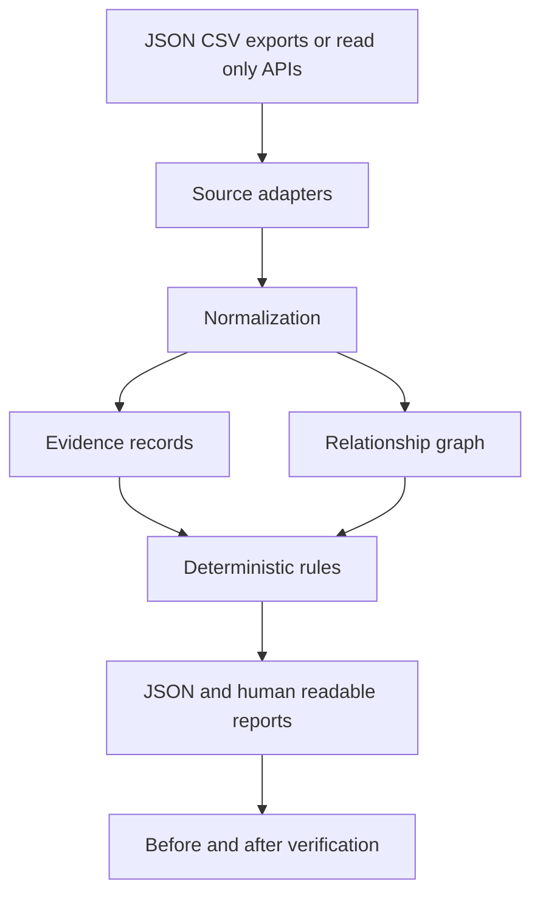

# Architecture

- **Status:** Current synthetic prototype structure
- **Owner:** Technical founder
- **Last updated:** 2026-09-18
- **Review date:** End of Phase 1

## Architectural objective

Build a modular monolith with a provider-neutral analysis core and replaceable
input adapters. The first industrial fixture and secondary AWS fixture must use
the same domain and analysis layers.

## Data flow



## Current package structure

```text
src/cyber_security_systems/
├── domain/
│   ├── __init__.py       # Public imports used by other packages
│   ├── enums.py          # Allowed types, classifications, and states
│   ├── models.py         # Immutable records, invariants, contract versions
│   └── _validation.py    # Shared field validation
├── ingestion/
│   └── fixtures.py       # Bounded synthetic JSON adapter
├── normalization/
│   └── inventory.py      # Cross-record evidence and supported semantics
├── analysis/
│   ├── engine.py         # One graph rule, findings, and comparison decisions
│   └── comparison.py     # Scope checks and before/after explanations
├── reporting/
│   └── reports.py        # JSON and escaped Markdown output
└── cli.py               # Command orchestration

fixtures/industrial/     # Synthetic examples, including example IDs
schemas/                 # Versioned JSON interchange schema

tests/
├── unit/
├── integration/
├── known_answer/
└── fixtures/
```

The `domain` and `analysis` packages must not import `boto3` or another
provider SDK.

Existing `infrastructure/` and `lambdas/` packages are earlier placeholders,
not part of the working analysis flow. An AWS adapter is deferred. Findings
and recommendations currently use report dictionaries rather than separate
domain classes. Split modules when distinct behavior warrants it, not simply
to allocate one file per class.

## Where values belong

| Kind of value | Location | Example |
| --- | --- | --- |
| Allowed domain vocabulary | `domain/enums.py` | `RelationshipType.MEMBER_OF` |
| Validated records | `domain/models.py` | `Relationship`, `Evidence`, `Policy` |
| Fixture/schema contract versions | `domain/models.py` | `SCHEMA_VERSION` |
| Parser resource limits | `ingestion/fixtures.py` | `MAX_BYTES` |
| Rule identity and supported path steps | `analysis/engine.py` | `RULE_VERSION`, `STEPS` |
| Synthetic resource IDs and labels | Fixture JSON or test data | A fictional entity ID and display name |
| Future deployment names and settings | Validated configuration at the adapter or CLI boundary | Lambda function ID, bucket name |

`RelationshipType` is an enum: a restricted vocabulary used for validation and
serialization, not a set of environment variables. Its existing serialized
values remain unchanged. Do not turn these into unvalidated string globals.

Do not add a generic `vals.py` containing domain vocabulary, sample customer
data, configuration, and report prose together. Keep a value with the component
that owns its meaning; share it only when several components need the same
contract. Example IDs belong to each input, so analysis can accept different
scenarios without editing Python source. Real credentials never belong in
constants or fixtures.

There is no deployment configuration model yet because the prototype has no
live adapter. Add one when there is a concrete adapter requirement and pass it
explicitly to that adapter. Avoid reading environment variables while importing
the domain or analysis packages.

Other packages use public imports such as:

```python
from cyber_security_systems.domain import Relationship, RelationshipType
```

This lets the domain's internal file layout evolve without changing every
caller. Reporting formats results; ingestion parses inputs; the CLI connects
the components. Domain models do not call those higher-level components.

## Component responsibilities

### Adapters

Read or import source-specific records. They do not make risk decisions.

### Normalization

Convert source records into stable domain entities, relationships, and
evidence. Preserve source references and observation times.

### Evidence records

Record where a fact originated, when it was observed, what value was collected,
and whether collection was complete.

### Relationship graph

Represent identities, access, network zones, hosts, applications, and
operational assets as a directed graph. Each edge references supporting
evidence.

### Rules

Use deterministic logic to find supported paths, classify completeness, and
identify remediation candidates. Rules must not infer unsupported edges.

### Reporting

Present paths, evidence, uncertainty, impact, remediation, limitations, and
before-and-after status. Reporting does not change analysis facts.

## Initial storage

The local Streamlit entry point (`streamlit_app.py`, launched with `make ui`)
uses the same engine as the CLI. Uploaded bytes go through the bounded fixture
parser, including duplicate-key, integrity, and synthetic-only checks. Results
remain in session memory and are cleared when input selections change.
`render_reports` supplies both browser downloads and CLI files, so the UI does
not introduce a second report format or analysis implementation. Streamlit is
an optional dependency; the CLI package does not require it.

Use in-memory objects and serialized reports during Phase 1. Do not add a
database until a validated workflow requires persistence, history, or
multi-user access.

## AI boundary

AI may rewrite structured findings for clarity after deterministic analysis.
AI must not establish facts, create graph edges, decide that a path exists,
assign confidence, or generate severity unsupported by evidence.

## Future deployment options

Future designs may include a local collector, hosted analysis service, or
partner-managed deployment. None are selected yet. Safety, customer access,
retention, and purchasing evidence should determine deployment.
