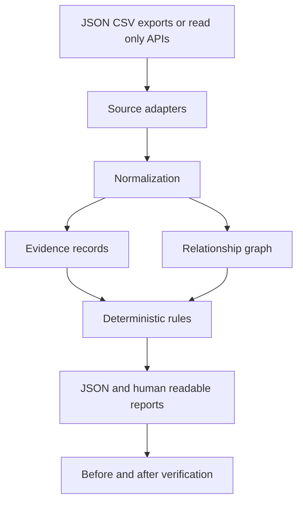

# Architecture

- **Status:** Proposed for Phase 1
- **Owner:** Technical founder
- **Last updated:** 2026-09-16
- **Review date:** End of Phase 1

## Architectural objective

Build a modular monolith with a provider-neutral analysis core and replaceable
input adapters. The first industrial fixture and secondary AWS fixture must use
the same domain and analysis layers.

## Data flow



## Proposed package structure

```text
src/cyber_security_systems/
├── domain/
│   ├── assets.py
│   ├── identities.py
│   ├── relationships.py
│   ├── evidence.py
│   ├── findings.py
│   └── remediations.py
├── ingestion/
│   ├── fixtures.py
│   └── aws/
├── normalization/
├── analysis/
│   ├── graph.py
│   ├── rules.py
│   ├── confidence.py
│   └── remediation.py
├── reporting/
│   ├── json_report.py
│   └── markdown_report.py
├── fixtures/
└── cli.py

tests/
├── unit/
├── integration/
├── known_answer/
└── fixtures/
```

The `domain` and `analysis` packages must not import `boto3` or another
provider SDK.

## Component responsibilities

### Adapters

Read or import source-specific records. They do not make risk decisions.

### Normalization

Convert source records into stable domain entities, relationships, and
evidence. Preserve source references and observation times.

### Evidence records

Record where a fact originated, when it was observed, what value was collected,
and whether collection was complete.

### Relationship graph

Represent identities, access, network zones, hosts, applications, and
operational assets as a directed graph. Each edge references supporting
evidence.

### Rules

Use deterministic logic to find supported paths, classify completeness, and
identify remediation candidates. Rules must not infer unsupported edges.

### Reporting

Present paths, evidence, uncertainty, impact, remediation, limitations, and
before-and-after status. Reporting does not change analysis facts.

## Initial storage

Use in-memory objects and serialized reports during Phase 1. Do not add a
database until a validated workflow requires persistence, history, or
multi-user access.

## AI boundary

AI may rewrite structured findings for clarity after deterministic analysis.
AI must not establish facts, create graph edges, decide that a path exists,
assign confidence, or generate severity unsupported by evidence.

## Future deployment options

Future designs may include a local collector, hosted analysis service, or
partner-managed deployment. None are selected yet. Safety, customer access,
retention, and purchasing evidence should determine deployment.

