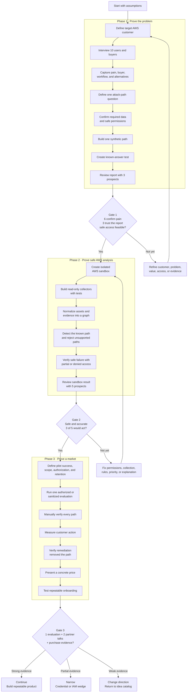
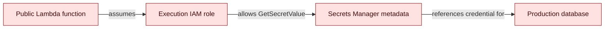
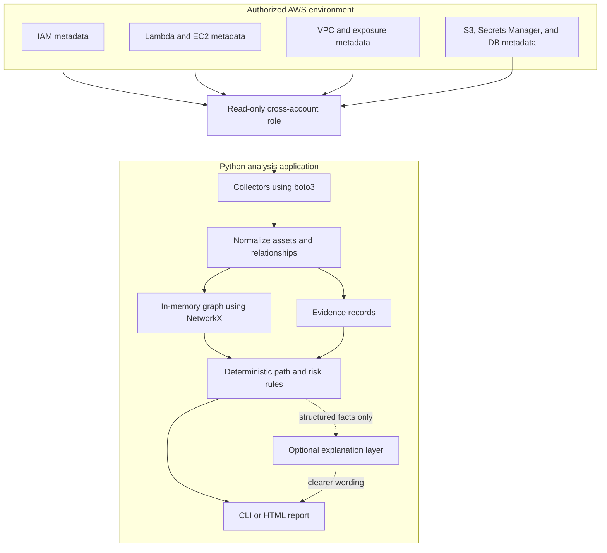
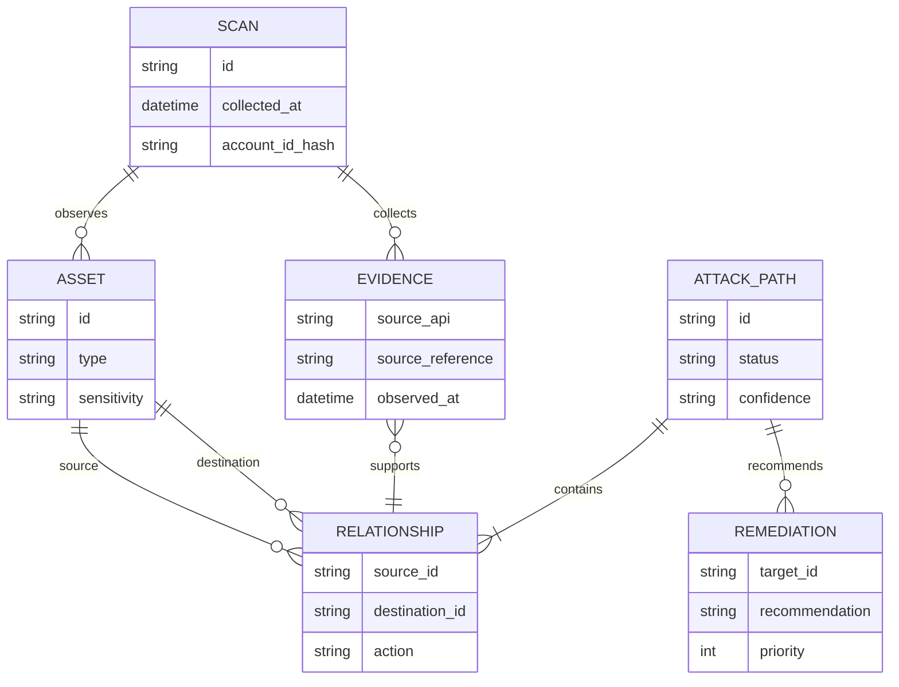
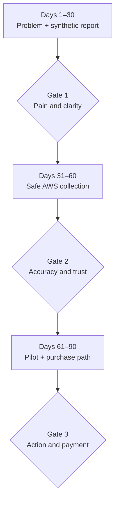
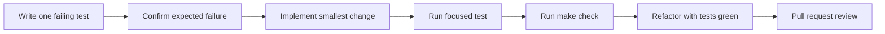

# Game plan

- **Working product:** Cloud Attack-Path Mapper
- **First wedge:** AWS credential and IAM blast-radius analysis
- **Validation window:** 2026-09-14 through 2026-12-13
- **Status:** Working direction pending customer evidence

## Mission

Help AWS-based companies answer:

> If an identity or entry point were compromised, what valuable resources
> could it reach, why, and what should we fix first?

The product is an evidence and prioritization layer—not another scanner and not
an autonomous hacking system.

## The game plan

Every build phase has a customer or evidence gate. Passing a technical demo
alone does not justify adding more features.

## MVP user story

> As a CTO or cloud/security engineer, I want to see the small number of
> evidence-backed ways a compromised AWS identity could reach a sensitive
> resource so I can choose the highest-impact remediation first.

## First vertical slice

Build one complete scenario before broadening AWS coverage:

Expected report:

- Path nodes and relationships.
- Evidence supporting every relationship.
- Preconditions and uncertainty.
- Potential impact without claiming proven exploitation.
- Ordered remediation steps.
- A stable identifier so the path can be retested.

## Proposed MVP architecture

### Architectural rules

- Collect metadata only; never call APIs that retrieve secret values or data.
- Use least-privilege, read-only access with an external ID for customer roles.
- Keep collection, normalization, analysis, and presentation separate.
- Every graph edge must reference evidence and collection time.
- Deterministic rules decide whether a path exists. AI may explain a path but
  must not create facts, permissions, or severity unsupported by evidence.
- Start with an in-memory graph and local sanitized fixtures. Add a database
  only when persistence is needed for a validated workflow.
- Do not build a web UI until prospects demonstrate that the report is useful.

## Core data model

This is a conceptual model. It does not require a relational database in the
first prototype.

## Workstreams

| Workstream | Outcome | Initial deliverable |
| --- | --- | --- |
| Customer discovery | Evidence that the problem and buyer exist | Interview script, notes, and synthesis |
| Security model | Safe access and defensible claims | Scope, permission policy, and threat model |
| Domain model | Stable representation of AWS relationships | Typed assets, edges, and evidence |
| Collection | Repeatable read-only inventory | IAM/Lambda/Secrets metadata collectors |
| Analysis | One supported path from entry to destination | Deterministic path rule and confidence |
| Reporting | Customer understands and acts on the result | One-page path report |
| Pilot operations | Safe, repeatable customer evaluation | Authorization and deletion checklist |

Each work item needs one directly responsible founder, even when both founders
contribute.

## Ninety-day execution plan

The validation period contains three 30-day gates. At each gate, review the
evidence and explicitly continue, narrow, or change direction.

### Days 1–30: Prove the problem and report

**Target dates:** 2026-09-14 through 2026-10-13

**Business**

- Define interview questions without pitching the answer.
- Recruit CTOs, AWS engineers, security engineers, and MSP analysts.
- Complete at least 10 interviews, including SaaS companies and MSPs.
- Record current tools, recent examples, urgency, budget owner, and access
  concerns.
- Show a report mockup only after learning how the prospect handles the problem
  today.

**Product and security**

- Write the first path fixture and expected report.
- Define asset, relationship, evidence, and path types.
- Write the minimum permission and data-handling rules.
- Create a founder-controlled AWS sandbox plan.
- Write failing tests for parsing the fixture into assets and relationships.
- Implement only enough normalization to pass those tests.
- Write failing tests for the expected path.
- Implement deterministic graph traversal and rule evaluation.
- Generate a simple terminal or static report.
- Review the synthetic report with at least three prospects.

**Day-30 gate:** At least six interviewees independently confirm the problem,
the fixture always produces the expected path, and three prospects can explain
the evidence and why it matters after reading the report.

### Days 31–60: Prove safe AWS collection

**Target dates:** 2026-10-14 through 2026-11-12

- Create a deliberately vulnerable but isolated founder-owned AWS scenario.
- Implement least-privilege metadata collectors with tests using recorded or
  mocked AWS responses.
- Confirm that no collector retrieves secret values or customer data.
- Compare collected data with the known sandbox configuration.
- Add failure handling for denied, missing, partial, and stale data.
- Produce evidence references and collection timestamps for every reported
  relationship.
- Review the sandbox report and proposed access model with at least five
  qualified prospects.
- Complete five additional interviews, emphasizing buyer, purchase process,
  access objections, and remediation workflow.

**Day-60 gate:** The tool detects the known sandbox path with no write access or
sensitive-value retrieval, rejects unsupported paths, and at least three of
five prospects say the report would change or accelerate a remediation
decision.

### Days 61–90: Prove the pilot and purchase path

**Target dates:** 2026-11-13 through 2026-12-13

- Ask at least five qualified buyers for a design-partner commitment and discuss
  pricing and procurement directly.
- Obtain written authorization before handling any non-founder environment or
  data.
- Prefer a sanitized inventory evaluation if legal, insurance, or access
  requirements are not ready for live collection.
- Complete an access, authorization, retention, incident, and deletion
  checklist before the evaluation.
- Run the smallest authorized evaluation and manually verify every reported
  path.
- Measure whether the customer changes priority, remediates a path, or requests
  continued monitoring.
- Present a concrete pilot or subscription price rather than asking only what
  the customer might pay.
- Decide to continue, narrow, or change direction.

**Day-90 gate:** At least two prospects enter design-partner discussions, one
completes an authorized evaluation, and one provides credible willingness-to-
pay or purchase-process evidence—or the founders explicitly narrow or change
the hypothesis.

### Gate review record

At days 30, 60, and 90, add a decision-log entry containing:

- Evidence collected versus the target.
- What was learned and what remains assumption.
- Product scope added, removed, or changed.
- Customer segment and buyer changes.
- Continue, narrow, or change-direction decision.
- Owners and dates for the next gate.

## Engineering workflow

Use test-driven development for domain behavior and collectors:

### Definition of done

- Acceptance behavior is covered by tests.
- Tests failed for the expected reason before implementation when TDD applies.
- `make check` passes.
- No credentials, account identifiers, secret values, or customer data are in
  code, fixtures, logs, screenshots, or commits.
- Errors and partial AWS permissions fail safely and visibly.
- Security-relevant assumptions are documented.
- Another founder reviews the pull request.

## Safety and authorization requirements

Before accessing any non-founder AWS environment:

- Obtain written authorization identifying the account and scope.
- Agree on allowed APIs, dates, contacts, and stop conditions.
- Use a dedicated read-only role with least privilege and an external ID.
- Never request long-lived customer access keys.
- Never retrieve secret values, object contents, database records, or customer
  payloads during the MVP.
- Encrypt stored metadata and minimize identifiers.
- Define retention and verified deletion.
- Keep an audit trail of collection activity.
- Establish an incident contact and immediately stop on unexpected access.
- Have qualified counsel review customer terms before a real pilot.

## Metrics

### Business evidence

- Qualified interviews completed.
- Interviewees who independently confirm the problem.
- Prospects who understand and trust the example report.
- Design-partner commitments.
- Pricing and purchase-process evidence.

### Product evidence

- Supported paths found in known fixtures.
- Unsupported paths correctly rejected.
- Percentage of relationships with complete evidence.
- Collector coverage and denied-access behavior.
- Prospect agreement with priority and remediation.

Do not optimize vanity metrics such as total findings, scanned resources, or
AI-generated explanations.

## Decision gates

### Continue

Continue when customers confirm recurring pain, trust the access model, act on
the report, and demonstrate a plausible purchase path.

### Narrow

Narrow to credential blast radius, IAM review, one AWS service chain, or MSPs
when the broad path concept is valuable but initial scope or access is too
large.

### Change direction

Return to the [idea catalog](IDEAS.md) when the problem is not urgent, prospects
will not permit safe read-only access, the report does not change decisions, or
no buyer owns the problem.

## Immediate next actions

1. Both founders review and approve the working direction.
2. Assign owners for customer discovery and the technical vertical slice.
3. Create the interview script and recruit the first five interviewees.
4. Write the first synthetic AWS path as a test fixture.
5. Define the expected one-page customer report.
6. Record the direction decision in [DEC-002](DECISIONS.md#dec-002-validate-the-cloud-attack-path-direction).
